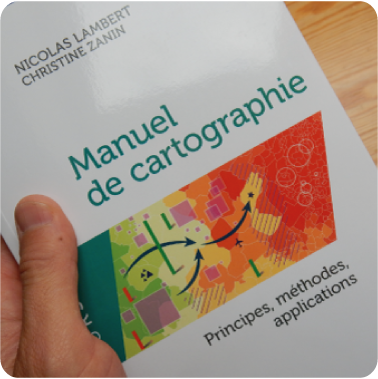
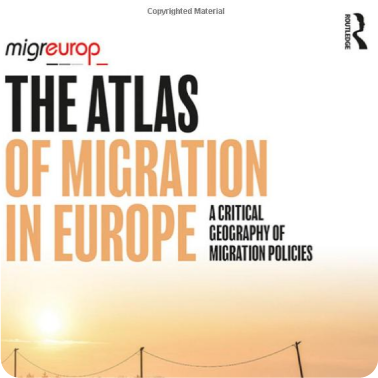
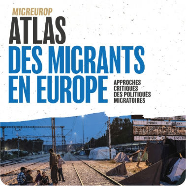
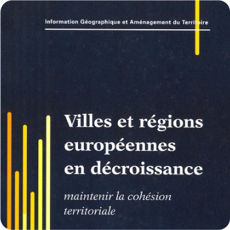
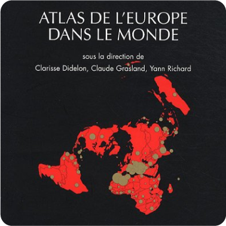
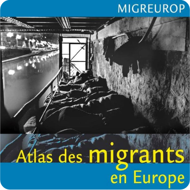

 

# En tant qu'auteur principal

 

|   |   |   |
|---|---|---|
| | |   |

Lambert, N., & Zanin, C. (2020). Practical Handbook of Thematic Cartography: Principles, Methods, and Applications. (S.l.): CRC Press. https://www.taylorfrancis.com/books/978042929196

Lambert, N., & Zanin, C. (2019). Mad Maps – L’atlas qui va changer votre vision du Monde. (S.l.): Armand Colin. https://www.armand-colin.com/mad-maps-latlas-qui-va-changer-votre-vision-du-monde

Lambert, N., & Zanin, C. (2016). Manuel de cartographie: principes, méthodes, applications. (S.l.): Armand Colin. https://www.armand-colin.com/manuel-de-cartographie-principes-methodes-applications-9782200612856

 

# Contributions majeures et/ou activités de coordination (cartographie)

 

|   |   |   |   |
|---|---|---|---|
|   |   |   |   |
|   |   |    |    |

<!-- # Contributions mineures (cartes ou textes) -->

<!-- |   |   |   |   | -->
<!-- |---|---|---|---| -->
<!-- |   |   |   |   | -->
<!-- |   |   |   |   | -->
