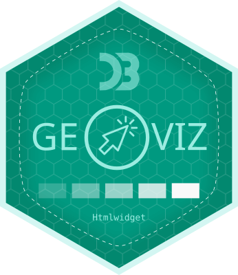
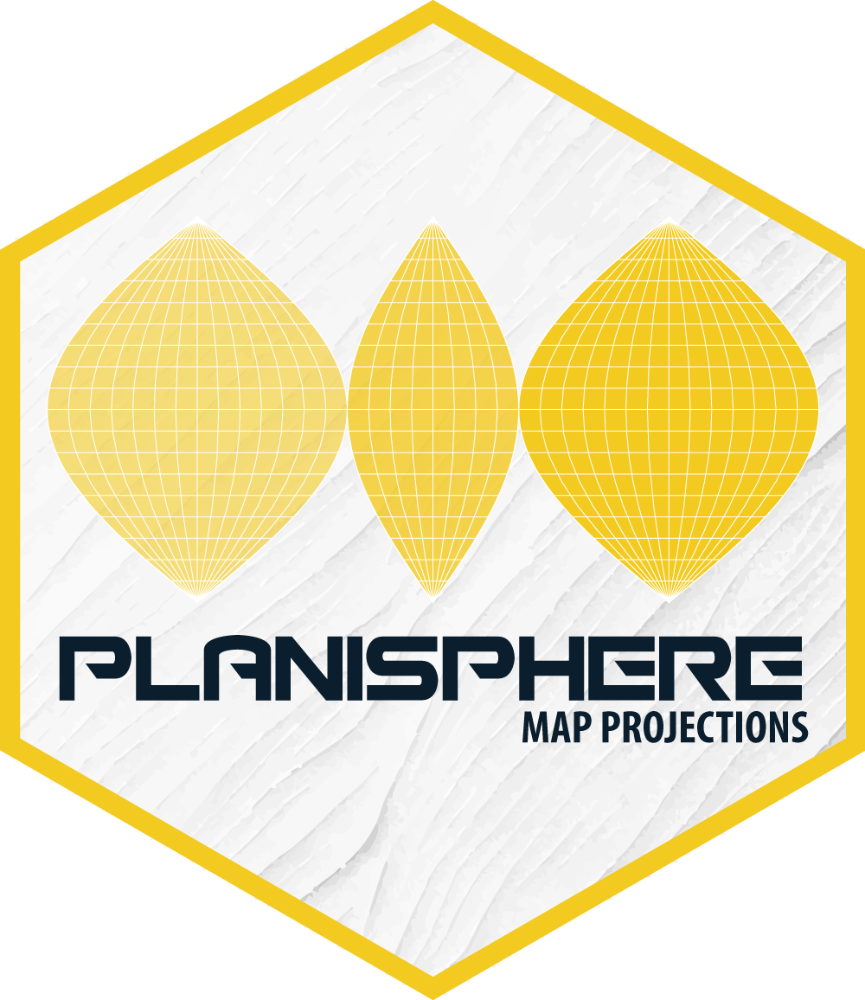

```js
import {menu} from "./helpers/menu.js"
```

<link rel="stylesheet" href="css/style.css">


<div class = "hero"><h1> </img> Nicolas Lambert</h1></div>

<div class="note">In this section, I share my main software development activities in R language. You'll find lots more on my <a href="https://github.com/neocarto" target = "_BLANK">github</a> 
account.</div>

```js
menu("R")
```

# Last R packages 

</img>

**[`geoviz`](https://github.com/riatelab/geoviz_R)** is an R package for thematic mapping. It's an R wrapper around the geoviz JavaScript library, itself based on the d3.js ecosystem. Like the original javascript library, the package can be used to create a wide range of interactive, zoomable vector maps, taking advantage of d3's many features: proportional symbols, pictograms, typologies, choropleth maps, spikes, tiles, Dorling cartograms, etc. It can also be used to create pretty static vectorial maps in SVG format, suitable for editorial cartography.

</img>

**[`planisphere`](https://github.com/riatelab/panisphere)** is an R package that provides access to a wide range of map projections. It allows spatial data frames containing geographic coordinates (latitude/longitude) to be projected. Projection calculations are performed using spherical geometry rather than ellipsoidal geodetic models.


# See also

**[`Mapepetrud`](https://github.com/neocarto/Mapepetrud)** (experimental) is an R package that allows to make extruded maps from sf objects (polygons or multipolygons).

**[`Flowmapper`](https://github.com/neocarto/Mapepetrud)** (experimental) fow maps in R. 

 

<div class="grid grid-cols-4" style="vertical-align: middle; display: flex;">
    <a href ="https://github.com/neocarto" target="_BLANK"><div class="card">
</img>
  </div></a>
</div>