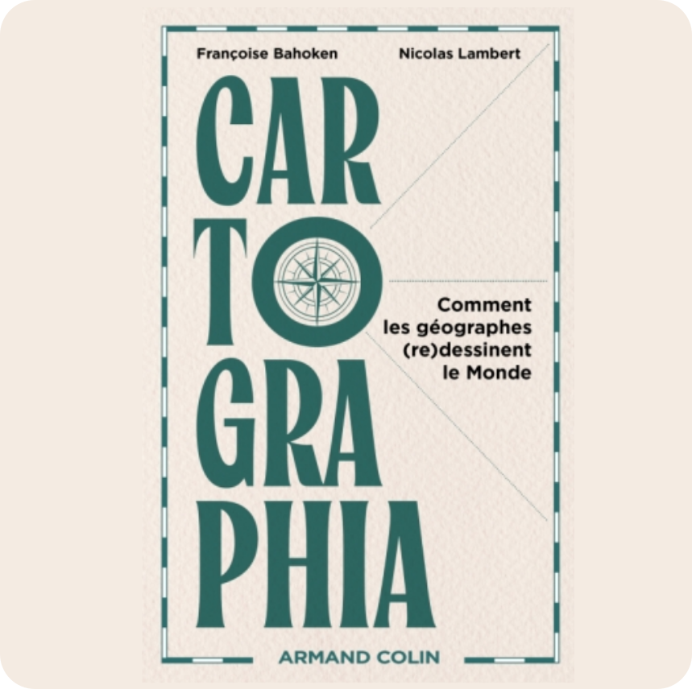
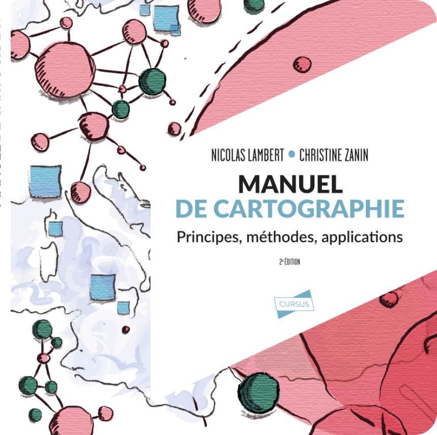

<link rel="stylesheet" href="css/style.css">

```js
import {menu} from "./helpers/menu.js"
```

<div class = "hero"><h1> </img> Nicolas Lambert</h1></div>

<div class="note">In this section, I list the books I've worked on. First, those for which I am the principal author. Then those on which I have worked a lot and fulfilled coordinating functions.</div>

```js
menu("books")
```


# As lead author 

<div class="grid grid-cols-3" align = "center">
<div class="card"><h1>2025</h1><p><a href ="https://www.taylorfrancis.com/books/978042929196" target = "_BLANK">Bahoken F. & Lambert, N. (2025).Cartographia - Comment les géographes (re)dessinent le Monde. Armand Colin.</a></p></div>
<div class="card"><h1>2025</h1><p><a href ="https://www.taylorfrancis.com/books/978042929196" target = "_BLANK">Lambert, N., & Zanin, C. (2025).Manuel de cartographie  (2e édition) : principes, méthodes, applications. Armand Colin.</a></p></div>
  <div class="card"><h1>2020</h1><p><a href ="https://www.taylorfrancis.com/books/978042929196" target = "_BLANK">Lambert, N., & Zanin, C. (2020). Practical Handbook of Thematic Cartography: Principles, Methods, and Applications. CRC Press.</a></p></div>
  <div class="card"><h1>2019</h1><p><a href ="https://www.armand-colin.com/mad-maps-latlas-qui-va-changer-votre-vision-du-monde" target = "_BLANK">Lambert, N., & Zanin, C. (2019). Mad Maps – L’atlas qui va changer votre vision du Monde. Armand Colin.</a></p></div>
  <div class="card"><h1>2016</h1><p><a href ="https://www.armand-colin.com/manuel-de-cartographie-principes-methodes-applications-9782200612856" target="_BLANK">Lambert, N., & Zanin, C. (2016). Manuel de cartographie: principes, méthodes, applications. Armand Colin.</a></p>
</div>
</div>

# Key contributions & coordination


<div class="grid grid-cols-4" align = "center">
  <div class="card">2022<br/><br/></div>
  <div class="card">2019<br/><br/></div>
  <div class="card">2017<br/><br/></div>
  <div class="card">2013<br/><br/></div>
  <div class="card">2010<br/><br/></div>
  <div class="card">2009<br/><br/></div>
</div>
