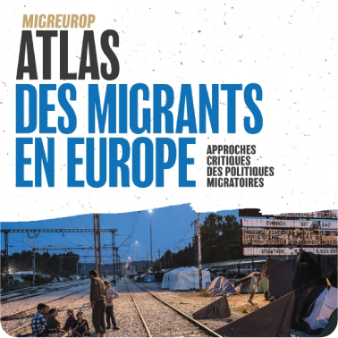

<style>

.hero {
  display: flex;
  flex-direction: column;
  align-items: left;
  font-family: var(--sans-serif);
  text-wrap: balance;
  text-align: left;
}

.hero h1 {
  margin: 2rem 0;
  max-width: none;
  font-size: 10vw;
  font-weight: 700;
  line-height: 1;
  background: linear-gradient(30deg, var(--theme-foreground-focus), currentColor);
  -webkit-background-clip: text;
  -webkit-text-fill-color: transparent;
  background-clip: text;
}

.hero h2 {
  margin: 0;
  max-width: 34em;
  font-size: 20px;
  font-style: initial;
  font-weight: 500;
  line-height: 1.5;
  color: var(--theme-foreground-muted);
}


@media (min-width: 640px) {
  .hero h1 {
    font-size: 50px;


  }
}

</style>

```js
import {menu} from "./helpers/menu.js"
```

<div class = "hero"><h1> </img> Nicolas Lambert</h1></div>

```js
menu("books")
```

<hr/>


# En tant qu'auteur principal

<div class="grid grid-cols-3">
  <div class="card">Lambert, N., & Zanin, C. (2020). Practical Handbook of Thematic Cartography: Principles, Methods, and Applications. (S.l.): CRC Press. https://www.taylorfrancis.com/books/978042929196</div>
  <div class="card">Lambert, N., & Zanin, C. (2019). Mad Maps – L’atlas qui va changer votre vision du Monde. (S.l.): Armand Colin. https://www.armand-colin.com/mad-maps-latlas-qui-va-changer-votre-vision-du-monde</div>
  <div class="card">Lambert, N., & Zanin, C. (2016). Manuel de cartographie: principes, méthodes, applications. (S.l.): Armand Colin. https://www.armand-colin.com/manuel-de-cartographie-principes-methodes-applications-9782200612856
</div>
</div>

<div class="grid grid-cols-4" align = "center">
  <div class="card">2022<br/><br/></div>
  <div class="card">2019<br/><br/></div>
  <div class="card">2017<br/><br/></div>
  <div class="card">2013<br/><br/></div>
  <div class="card">2010<br/><br/></div>
  <div class="card">2009<br/><br/></div>
</div>
