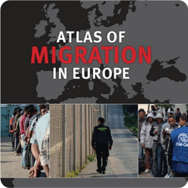

# Livres & Atlas

xx

### En tant qu'auteur principal

  
Lambert, N., & Zanin, C. (2020). Practical Handbook of Thematic Cartography: Principles, Methods, and Applications. (S.l.): CRC Press. https://www.taylorfrancis.com/books/978042929196

  
Lambert, N., & Zanin, C. (2019). Mad Maps – L’atlas qui va changer votre vision du Monde. (S.l.): Armand Colin. https://www.armand-colin.com/mad-maps-latlas-qui-va-changer-votre-vision-du-monde

  
Lambert, N., & Zanin, C. (2016). Manuel de cartographie: principes, méthodes, applications. (S.l.): Armand Colin. https://www.armand-colin.com/manuel-de-cartographie-principes-methodes-applications-9782200612856

### Contributions majeures et/ou activités de coordination

  
2022  

  
2019  

  
2017  

  
2013  

  
2010  

  
2009  

