 

[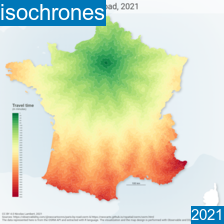](https://observablehq.com/@neocartocnrs/paris-by-road-osrm)
[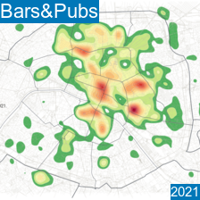](https://observablehq.com/@neocartocnrs/bars-pubs-in-paris)
[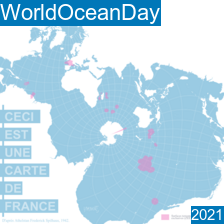](https://www.humanite.fr/la-france-cest-94-deau-la-preuve-avec-notre-carte-interactive-709949)
[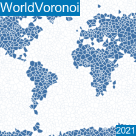](https://observablehq.com/@neocartocnrs/world-grids)
[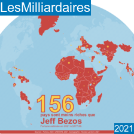](https://observablehq.com/@neocartocnrs/countries-vs-billionaires)
[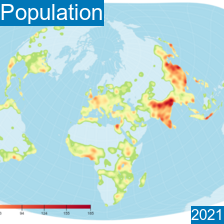](https://observablehq.com/@neocartocnrs/d3-contour-and-world-population)
[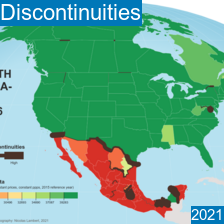](https://observablehq.com/@neocartocnrs/mapping-discontinuities)
[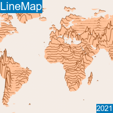](https://observablehq.com/@neocartocnrs/world-elevation-line-map)
[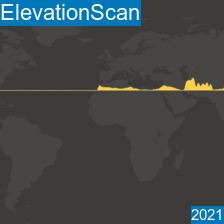](https://observablehq.com/@neocartocnrs/elevation)
[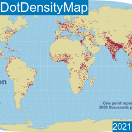](https://observablehq.com/@neocartocnrs/dotdensity-map)
[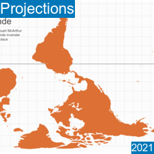](https://observablehq.com/@neocartocnrs/the-organization-of-cartographers-for-social-equality)
[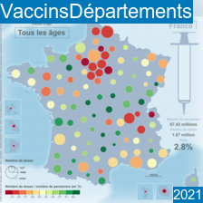](https://observablehq.com/@neocartocnrs/vaccination-against-covid-19-in-france)
[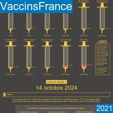](https://observablehq.com/@neocartocnrs/vaccination-in-france-by-age-group)
[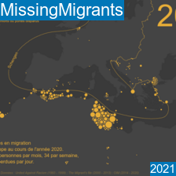](https://observablehq.com/@neocartocnrs/49394-deaths-in-migration-in-europes-neighbourhood-1993-20)
[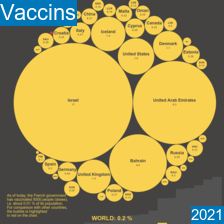](https://neocarto.hypotheses.org/12308)
[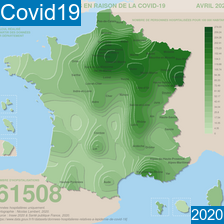](https://www.humanite.fr/les-effets-du-covid-sur-votre-region-depuis-mars-regard-de-cartographe-1-697121)
[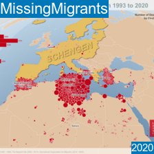](https://analytics.huma-num.fr/Nicolas.Lambert/theborderkills/)
[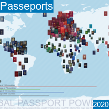](https://neocarto.hypotheses.org/11580)
[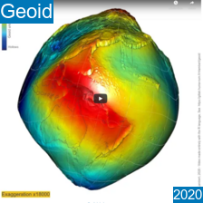](https://www.youtube.com/watch?v=2xVNvXb6N6g)
[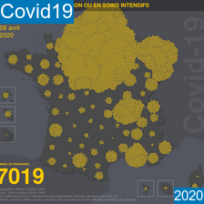](https://gitlab.huma-num.fr/nlambert/covid19/-/raw/master/maps/rea/rea.mp4)
[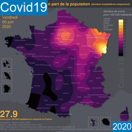](https://gitlab.huma-num.fr/nlambert/covid19/-/raw/master/maps/smooth/smooth.mp4)
[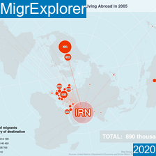](https://analytics.huma-num.fr/Nicolas.Lambert/migrexplorer/)
[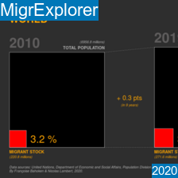](https://analytics.huma-num.fr/Nicolas.Lambert/migrexplorer2/)
[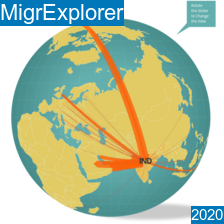](https://analytics.huma-num.fr/Nicolas.Lambert/migrexplorer3/)
[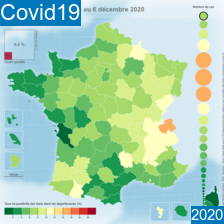](https://neocarto.hypotheses.org/11372)
[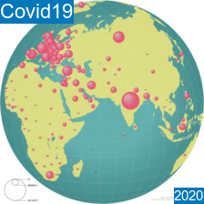](https://neocarto.hypotheses.org/11327)
[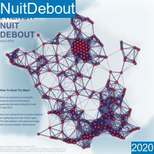](https://neocarto.hypotheses.org/11145)
[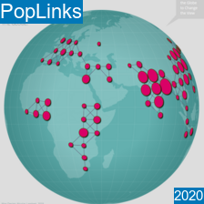](https://analytics.huma-num.fr/Nicolas.Lambert/poplinks/)
[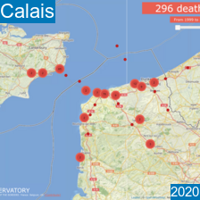](https://neocarto.github.io/calais/en/)
[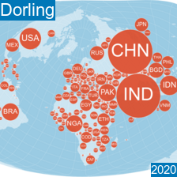](https://observablehq.com/@neocartocnrs/dorling-cartogram)
[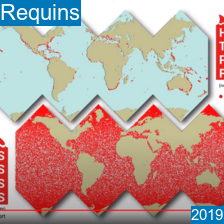](https://youtu.be/QkQaUp2_UI4)
[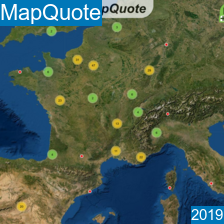](https://neocarto.github.io/mapquote/)
[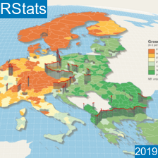](https://neocarto.github.io/ironcurtain/ironcurtain.html)
[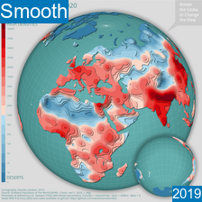](https://neocarto.github.io/noborder/)
[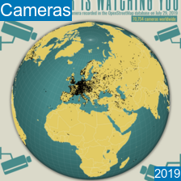](https://neocarto.github.io/bigbrother/index.html)
[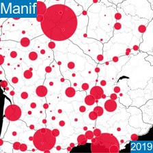](https://neocarto.github.io/manif5dec/)
[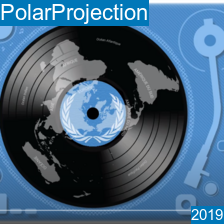](https://youtu.be/AC6QhqpXJ8c/)
[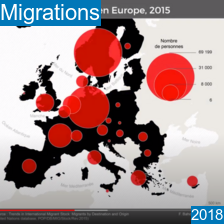](https://youtu.be/uicwYbendUk)
[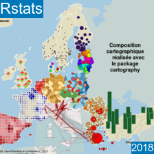](https://riatelab.github.io/anfdataviz/)
[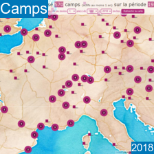](https://neocarto.github.io/closethecamps/)

 

D'autres cartes et outils interactifs sont à retrouver sur le blog [Neocarto](https://neocarto.hypotheses.org/author/neocarto) ou sur mon [notebook Observable](https://observablehq.com/@neocartocnrs?tab=notebooks).

